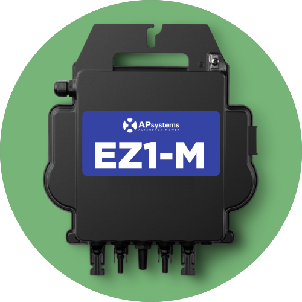
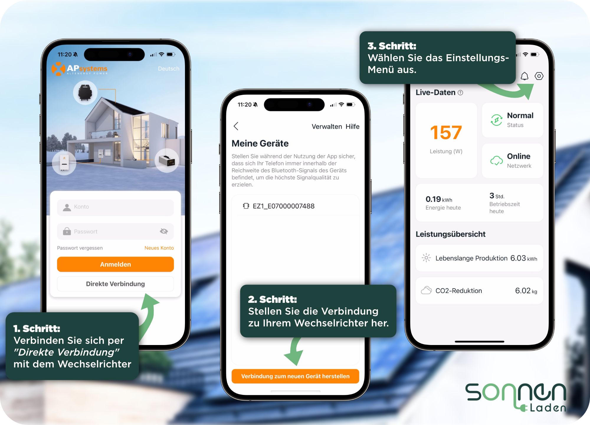
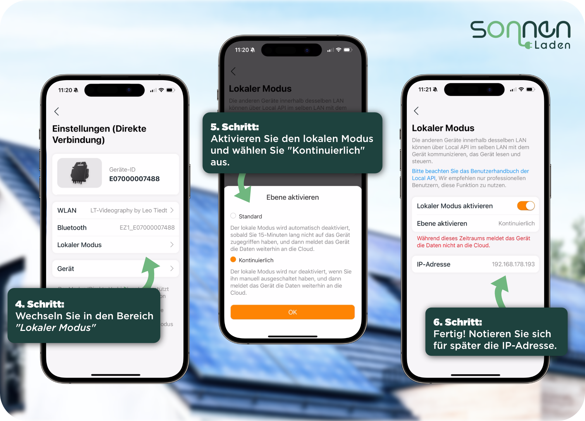

# APsystems EZ1 -  Home Assistant Integration

## Overview
- The APsystems EZ1 Home Assistant Integration can be used to interact with APsystems EZ1 Microinverters. It provides a convenient way to communicate with the microinverter over your **local network**, allowing you to read and set various device parameters like power status, alarm information, device information, and power limits and use those for automations.
- This Home Assistant Integration is **based on our APsystems API library** which you can find here: https://github.com/SonnenladenGmbH/APsystems-EZ1-API
---

## About Sonnenladen GmbH
This HA integration is published, maintained, and developed by Sonnenladen GmbH. Our collaboration with the APsystems R&D Team has been instrumental in making this API a reality. At Sonnenladen GmbH, we are committed to providing top-notch solar energy solutions and are excited to offer this library to enhance the experience of using APsystems inverters.

## Purchase APsystems Inverters
For those interested in purchasing APsystems inverters, please visit our German online shop at [Sonnenladen](https://www.sonnenladen.de/). We offer a range of APsystems products, backed by our expertise in solar energy solutions.

---
## Features
- **Easy & Fast Setup within Home Assistant**
- **Get detailed device information**
- **Retrieve alarm status information**
- **Fetch output data** (power output, energy readings)
- **Set and get maximum power limits** (30 W up to 800 W)
- **Manage device power status** (sleep_mode/on/off)
- **Calculate combined power output and total energy generated**
- **Use all of these values for anything within Home Assistant!** 
- and much more...

## Device Compatibility
- This table includes all micro-inverters we tested and can confirm 100 % compatbility with this HA integration.
<table>
<tbody>
<tr>
<th>Device</th>
<th>Name</th>
<th>Support / Compatibility</th>
<th>Available to purchase at:</th>
</tr>
<tr>
<td align="center"></td>
<td align="center">
<p><strong>APsystems EZ1-M</strong></p>
<p>(Firmware: V1.17)</p>
</td>
<td align="center"></td>
<td align="center"><a href="https://www.sonnenladen.de/APsystems-EZ1-M-600-800-W-Mikrowechselrichter-ohne-Anschlusskabel/AP-07-000-0" target="_blank" rel="noopener"><strong>Sonnenladen GmbH - Online Shop</strong></a><br /><a href="https://www.sonnenladen.de/APsystems-EZ1-M-600-800-W-Mikrowechselrichter-ohne-Anschlusskabel/AP-07-000-0" target="_blank" rel="noopener">IN STOCK | AUF LAGER</a></td>
</tr>
</tbody>
</table>

## Setup your Inverter
The local API access needs to be activated once in the settings of the EZ1. Please follow our Step-By-Step Guide to do so:
<p></p>
<ul>
<li>Step 1: Connect to the inverter using the "Direct Connection" method.</li>
<li>Step 2: Establish a connection with your inverter.</li>
<li>Step 3: Select the Settings menu.</li>
</ul>
<p></p>
<ul>
<li>Step 4: Switch to the "Local Mode" section.</li>
<li>Step 5: Activate local mode and select "Continuous"</li>
<li>Step 6: Done! Make a note of the IP address for future reference.</li>
(To ensure a successful connection to your Wi-Fi network, it's essential to first set up your device using the standard procedure outlined in the APsystems Quickstart Guide. This initial setup is a crucial step before proceeding with any further configurations or usage.)
</ul>

## Installation (IMPORTANT)
Please note that **this is not a regular HA add-on** that can be installed by just searching for it inside the add-on store. For this HA-Integration to work, **you need to install HACS (Home Assistant Community Store)** first.<br>
<br>
**Please follow our 4-Step guide to successfully get this Integration running:**
1. After you set up your Home Assistant instance please follow this 3 minute video on how to install HACS: [How to install HACS within only 3 minutes [YouTube]](https://youtu.be/Q8Gj0LiklRE?si=_YqpNZ2yOE5sRUjd&t=44)<br>
2. Now that HACS is installed go to its dashboard and click the three small dots in the upper right corner. Select `Custom repositories` and add this URL ( Category = Integration)
```bash
https://github.com/SonnenladenGmbH/APsystems-EZ1-API-HomeAssistant
```
3. After adding our tntegration you can search for it by `APsystems Local API` using the search of HACS. Then download and install it.
4. Before you can configure a new device you need to restart Home Assistant.
5. You have now successfully installed our APsystems HA Integration 🎉🌳

## Add an new device to Home Assistant
Adding your first APsystems inverter to Home Assistant is very easy and straigt forward.
1. to be continued...


## Methods
The library includes several methods to interact with the microinverter. You can find all of them with comprehensive docs ion our GitHub Pages.

* `get_device_info()`: Retrieves detailed information about the device.
* `get_alarm_info()`: Fetches the alarm status information for various components of the device.
* `get_output_data()`: Retrieves the output data from the device.
* `get_total_energy_today()`: Retrieves the total energy generated today by inverter inputs.
* `get_total_energy_lifetime()`: Retrieves the total lifetime energy generated by inverter inputs.
* `get_max_power()`: Retrieves the set maximum power setting of the device.
* `set_max_power(power_limit)`: Sets the maximum power limit of the device.
* `get_device_power_status()`: Retrieves the current power status of the device.
* `set_device_power_status(power_status)`: Sets the power status of the device.
* for a more detailed documentation see our GitHub Pages.
## Recommendations
- We highly recommend to set a **static IP** for the inverter you want to interact with. This can be achieved be accessing your local router, searching for the inverters IP and setting it to "static ip" or similar. A quick Google search will tell you how to do it exactly for your specific router model.

## Contribute to this project
- Everyone is invited to commit changes to this integration. This is considered a community project to realise countless projects that may need very specific new functionality. We're happy to see your ideas ;)
- You're also welcome to request new features to be built natively into the inverters API. We're in close contact with APsystems and happy to add new features in the future.
## License
This project is released under the MIT License.

---
